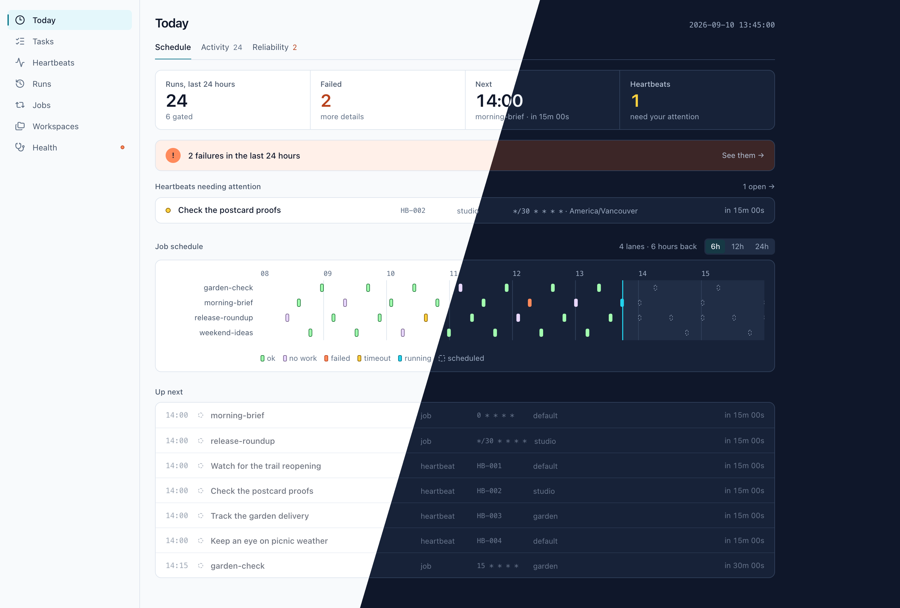
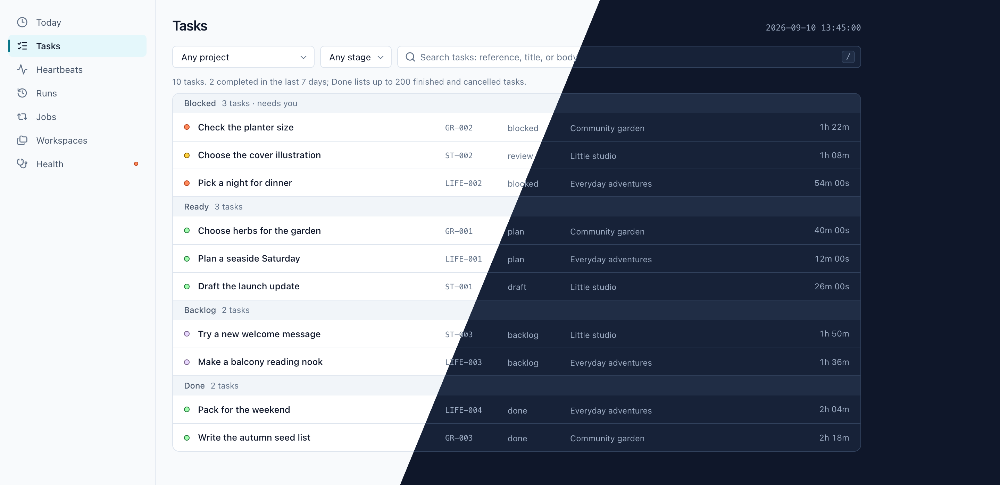

# Enso

A little genius in your corner.

Enso is a personal AI assistant for everyday loose ends, ideas worth chasing, and
whatever you're into next. It runs on your own machine, and you talk to it in Slack
or Telegram. Choose the agent CLI that powers it, give it some context, and give it
something to work on.

Plan a weekend away. Turn rough notes into a plan. Keep an eye on a release. Enso
can work on a schedule and follow up after the conversation ends. Work lives in
ordinary files on your machine, and a read-only web viewer shows what's happening,
what's coming up, and what needs your attention.



## What it does

- **Give it context.** Keep your preferences, project instructions, and reference
  files in workspaces, so Enso has the background when you pick things up again.
- **Build your knowledge.** Maintain linked Markdown with Enso, in shared or workspace
  folders, and browse it in the read-only viewer with search and backlinks.
- **Keep projects moving.** Turn conversations into tasks, carry work through
  simple stages, and follow the progress and evidence in the viewer. Development
  workflows can use separate Git worktrees and required tests or lint checks;
  a single unchecked stage works too.
- **Let it follow through.** Schedule a morning brief or weekly review. Ask Enso to
  watch for a refund, check on a release, or remind you on Friday.
- **Make it yours.** Add skills, connect persistent browser profiles, or install
  optional skills from the official catalog.

Enso is powered by Claude Code, Codex, Grok, Antigravity, or OpenCode. Each provider
CLI manages its own sessions and permissions.

The provider, model, and effort are always explicit. A workspace organizes context;
it is not a security sandbox. The viewer is a window into Enso, not a control panel.



*Both screenshots use example data.*

## Get started

Enso is in pre-1.0 beta and runs on macOS and Linux. You need an authenticated agent
CLI and a Slack app or Telegram bot; the release installer supplies Python and uv
when needed.

Install Enso with one command:

```bash
curl -fsSL https://github.com/geekforbrains/enso/releases/latest/download/install.sh | sh
```

The installer supplies Enso and its dependencies without a source checkout. Make
sure `~/.local/bin` is on your `PATH`, then run `enso setup`.

Setup connects your chat, prepares a default workspace, and offers to run Enso as a
background service. Once it is running, say `!help` in Slack or `/help` in Telegram,
then send a normal message to check that Enso can answer.

See [installation and setup](docs/install.md) for requirements, Slack app creation,
service management, and upgrades. Working from a checkout? Start with
[local development](docs/development.md) instead; the root `install.sh` is not the
standalone release installer.

## Documentation

The [docs site](https://ensobot.ai/docs/) provides readable guides and worked examples.
The pages here own technical behavior, configuration contracts, and development guidance.

- [Concepts](docs/concepts.md) — the starting point and how Enso fits together.
- [Configuration](docs/configuration.md) and [workspaces](docs/workspaces.md) —
  providers, chat routing, permissions, and layout.
- [Knowledge](docs/knowledge.md) — shared Markdown, folders, links, formatting, and imports.
- [Jobs](docs/jobs.md), [Heartbeat](docs/heartbeat.md), and [tasks](docs/tasks.md) —
  scheduled work, follow-ups, and project boards.
- [Customization and skills](docs/customizing.md) and [browser setup](docs/browser.md) —
  instructions, the official skill catalog, and persistent profiles.
- [Web viewer](docs/web.md) and [CLI reference](docs/cli.md) — seeing and operating Enso.

## Contributing

Small, focused pull requests are welcome. Start with [CONTRIBUTING.md](CONTRIBUTING.md)
for the contribution flow, [development](docs/development.md) for setup and conventions,
and [AGENTS.md](AGENTS.md) when working with a CLI agent. Maintainers follow the
[manual release checklist](docs/releasing.md).

## License

[MIT](LICENSE)
